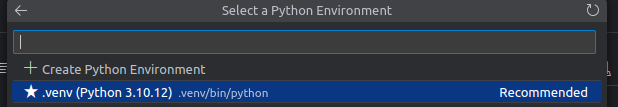

# Heart Disease Prediction using XGBoost

This project focuses on predicting the presence of heart disease in patients using the XGBoost algorithm. It leverages a dataset with various health-related features to build a predictive model that evaluates the likelihood of heart disease based on these attributes.

## Table of Contents

1. [Introduction](#introduction)
2. [Data Loading and Preprocessing](#data-loading-and-preprocessing)
   - [Loading the Data](#loading-the-data)
   - [Handling Missing Values](#handling-missing-values)
   - [Data Transformation](#data-transformation)
3. [Exploratory Data Analysis (EDA)](#exploratory-data-analysis-eda)
   - [Distribution of Heart Disease](#distribution-of-heart-disease)
   - [Distribution of Cholesterol](#distribution-of-cholesterol)
4. [Modeling](#modeling)
   - [Train-Test Split](#train-test-split)
   - [Model Training and Evaluation](#model-training-and-evaluation)
     - [Random Forest Classifier](#random-forest-classifier)
     - [XGBoost Classifier](#xgboost-classifier)
5. [Conclusion](#conclusion)

## Project Overview

The aim of this project is to create a machine learning pipeline to predict heart disease from health-related features. The dataset includes variables such as age, cholesterol levels, and exercise-induced angina. Using XGBoost, we strive to achieve accurate predictions and provide valuable insights into the contributing factors.

## Dataset

The dataset used in this project is `heart.csv` [1]. It contains the following columns [1]:

- `Age`: Age of the patient [years]
- `Sex`: Sex of the patient [M: Male, F: Female]
- `ChestPainType`: Chest pain type [TA: Typical Angina, ATA: Atypical Angina, NAP: Non-Anginal Pain, ASY: Asymptomatic]
- `RestingBP`: Resting blood pressure [mm Hg]
- `Cholesterol`: Serum cholesterol [mm/dl]
- `FastingBS`: Fasting blood sugar [1: if FastingBS > 120 mg/dl, 0: otherwise]
- `RestingECG`: Resting electrocardiogram results [Normal: Normal, ST: having ST-T wave abnormality (T wave inversions and/or ST elevation or depression of > 0.05 mV), LVH: showing probable or definite left ventricular hypertrophy by Estes' criteria]
- `MaxHR`: Maximum heart rate achieved [Numeric value between 60 and 202]
- `ExerciseAngina`: Exercise-induced angina [Y: Yes, N: No]
- `Oldpeak`: Oldpeak = ST [Numeric value measured in depression]
- `ST_Slope`: The slope of the peak exercise ST segment [Up: upsloping, Flat: flat, Down: downsloping]
- `HeartDisease`: Output class [1: heart disease, 0: Normal]

## Installation

<!-- write assumption that we are working with linux or macos system -->

To run this project, you need to have Python installed on your system. You can download Python from the [official website](https://www.python.org/downloads/). In terms of OS, we assume that you are working with a Linux or macOS system, however, the project should also work on Windows (assuming you have the necessary dependencies installed).
First, the Poetry need to be installed. If you don't have Poetry installed, you can install it by following the instructions on the [Poetry website](https://python-poetry.org/docs/#installation).


First, configure Poetry to create virtual environments inside the project directory:

```bash
poetry config virtualenvs.in-project true
```

Then, install the dependencies (based on pyptoject.toml and corresponding poetry.lock):

```bash
poetry install
```

## Usage

To run the notebook, use the following command:

```bash
poetry run jupyter notebook
```

## Setting the Kernel to Use Poetry Virtual Environment:

To use the Poetry virtual environment as the kernel in Jupyter Notebook, use created (in directory containing the project files) .venv environment as kernel.

   ```bash
   poetry shell
   ipython kernel install --name "capstone" --user 
   ```



## Exploratory Data Analysis (EDA) and Feature Engineering

Before building the model, we perform exploratory data analysis (EDA) to understand the structure of the data and check for any inconsistencies or missing values. This includes visualizing the distribution of the target variable (heartdisease) and other features.

Exploratory Data Analysis (EDA)
Distribution of Target Variable:

1. We visualize the distribution of the heartdisease variable to understand the proportion of patients with and without heart disease.

2. Feature Distributions:
We plot the distributions of various features such as age, sex, chestpaintype, restingbp, cholesterol, fastingbs, restingecg, maxhr, exerciseangina, oldpeak, and st_slope to understand their spread and identify any potential outliers.

3. Correlation Analysis:
We create a correlation matrix to identify the relationships between different features and the target variable. This helps in understanding which features are most strongly associated with heart disease.

4. Handling Missing Values:
We check for any missing values in the dataset and handle them appropriately, either by imputing them or removing the affected rows.


## Model Training

We use Random Forest and XGBoost classifiers to predict the presence of heart disease based on the provided features. The models are trained using processed data and evaluated using various metrics.

## Model Evaluation

The models’ performance is evaluated using metrics such as accuracy, confusion matrix, classification report, and ROC curve. Additionally, feature importance analysis reveals which features contribute most to the prediction.

## Hyperparameter Tuning

We use GridSearchCV to perform hyperparameter tuning and find the optimal hyperparameters for the models, enhancing their performance.


## Conclusion

The XGBoost classifier achieved a high accuracy, demonstrating its effectiveness in predicting heart disease. The feature importance analysis provides insights into the most influential factors, aiding healthcare professionals in better understanding patient risks.

## Additional Consideration

Additional Considerations

- **Handling Imbalanced Data:** If the dataset is imbalanced, techniques like SMOTE or undersampling can be used to balance the classes.

- **Feature Engineering:** Explore creating new features or transforming existing ones to provide the model with more informative inputs.

- **Explaining Model Predictions:** Consider using SHAP (SHapley Additive exPlanations) for model interpretability.


## Training the model
To train the model, run the following command:

   ```bash
   python train.py
   ```

**Using an Existing Model**

If you want to use an existing model and DictVectorizer, you can use them by moving the files from the model directory to the current directory.


If you have an existing model and DictVectorizer, you can use them by moving the files from the model directory to the current directory:

This will generate the model and save it along with the DictVectorizer in the current directory.

## Using the model

To use the model, follow these steps:

1. Build the Docker image using the following command (please notice requirements.txt file for dockerized version, in comparison to pyproject.toml file for local version):

   ```bash
   docker build -t predict:latest .
   ```

2. Run the Docker container using the following command:

   ```bash
   docker run -d -p 9696:9696 predict:latest
   ```

This will start the FastAPI application inside the Docker container, and it will be accessible at http://localhost:9696.

3. Run the request.py script to send data to the FastAPI endpoint and get predictions:

   ```bash
   python request.py
   ```

**Using the Streamlist App**

To use the Streamlit app for heart disease prediction, follow these steps:

1. Navigate to the directory containing the app.py file.

2. Run the Streamlit app using the following command:

   ```bash
   streamlit run app.py
   ```


## Bibliography

For more information, please refer to the following sources:

1. [Heart Disease Prediction using Machine Learning](https://www.kaggle.com/datasets/fedesoriano/heart-failure-prediction/data)
