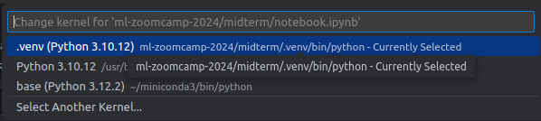
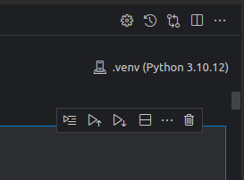

# Diabetes Prediction using Random Forest

This project aims to predict the presence of diabetes in patients using the Random Forest algorithm. The dataset contains various health-related features of patients, and the goal is to build a model that can accurately predict whether a patient has diabetes based on these features.

## Table of Contents

1. [Project Overview](#project-overview)
2. [Dataset](#dataset)
3. [Installation](#installation)
4. [Usage](#usage)
5. [Exploratory Data Analysis (EDA) and Feature Engineering](#exploratory-data-analysis-eda-and-feature-engineering)
6. [Model Training](#model-training)
7. [Model Evaluation](#model-evaluation)
8. [Hyperparameter Tuning](#hyperparameter-tuning)
9. [Handling Imbalanced Data](#handling-imbalanced-data)
10. [Conclusion](#conclusion)
11. [Additional Recommendations](#additional-recommendations)
12. [Training the model](#training-the-model)
13. [Using the model](#using-the-model)

## Project Overview

In this project, we use a dataset containing various health-related features of patients to predict the presence of diabetes. We employ the Random Forest algorithm for this task and evaluate the model's performance using various metrics.

## Dataset

The dataset used in this project is `diabetes_prediction_dataset.csv`. It contains the following columns:

- `gender`: Gender of the patient (e.g., Male, Female)
- `age`: Age of the patient
- `hypertension`: Whether the patient has hypertension (0: No, 1: Yes)
- `heart_disease`: Whether the patient has heart disease (0: No, 1: Yes)
- `smoking_history`: Smoking history of the patient (e.g., never, former, current)
- `bmi`: Body Mass Index of the patient
- `hba1c_level`: HbA1c level of the patient
- `blood_glucose_level`: Blood glucose level of the patient
- `diabetes`: Whether the patient has diabetes (0: No, 1: Yes)

## Installation

First, the Poetry need to be installed. If you don't have Poetry installed, you can install it by following the instructions on the [Poetry website](https://python-poetry.org/docs/#installation).


First, configure Poetry to create virtual environments inside the project directory:

```bash
poetry config virtualenvs.in-project true
```

Then, install the dependencies (based on pyptoject.toml and corresponding poetry.lock):

```bash
poetry install
```

## Usage

To run the notebook, use the following command:

```bash
poetry run jupyter notebook
```

## Setting the Kernel to Use Poetry Virtual Environment:

To use the Poetry virtual environment as the kernel in Jupyter Notebook, use created .venv environment as kernel.

```bash
poetry shell
ipython kernel install --name "midterm" --user 
```




## Exploratory Data Analysis (EDA) and Feature Engineering


Before building the model, we perform exploratory data analysis to understand the structure of the data and check for any inconsistencies or missing values. This includes visualizing the distribution of the target variable (`diabetes`) and other features.

We explore creating new features or transforming existing ones to provide the model with more informative inputs.
During EDA, we create new features such as `bmi_category` and `age_range`:
- **BMI Category**: Categorizes the BMI values into groups such as Underweight, Normal, Overweight, and Obese.
- **Age Range**: Categorizes the age values into ranges such as 0-18, 19-30, 31-45, 46-60, and 60+.

## Model Training

We use the Random Forest algorithm to train our model on the training data. The model is trained using the `RandomForestClassifier` from `sklearn`.

## Model Evaluation

We evaluate the model's performance using various metrics such as accuracy, confusion matrix, classification report, and ROC curve. We also analyze the feature importance to understand which features contribute most to the prediction.

## Hyperparameter Tuning

We use `GridSearchCV` to perform hyperparameter tuning and find the optimal hyperparameters for the Random Forest model. This helps in enhancing the model's performance.

## Handling Imbalanced Data

If the dataset has an imbalanced distribution of classes, we use techniques like SMOTE (Synthetic Minority Over-sampling Technique) to balance the classes and improve the model's performance.

## Conclusion

The Random Forest model achieved an accuracy of approximately 95%, indicating a high level of performance in predicting diabetes based on the provided features. The confusion matrix and classification report further confirm the model's reliability, showing minimal false positives and false negatives. Feature importance analysis reveals which factors are most influential in the predictions, providing valuable insights for healthcare professionals.

## Additional Consideration

- **Hyperparameter Tuning:** We utilize techniques like `GridSearchCV` to find the optimal hyperparameters for the Random Forest model, potentially enhancing its performance.
- **Handling Imbalanced Data:** If the dataset has an imbalanced distribution of classes, we may consider using techniques like SMOTE or undersampling to balance the classes.
- **Feature Engineering:** Explore creating new features or transforming existing ones to provide the model with more informative inputs.

By following these recommendations, we further improve the model's performance and gain deeper insights into the factors influencing diabetes.

## Training the model
To train the model, run the following command:

```bash
python train.py
```

**Using an Existing Model**

If you want to use an existing model and DictVectorizer, you can use them by moving the files from the model directory to the current directory.


If you have an existing model and DictVectorizer, you can use them by moving the files from the model directory to the current directory:

This will generate the model and save it along with the DictVectorizer in the current directory.

## Using the model

To use the model, follow these steps:

1. Build the Docker image using the following command:

```bash
docker build -t predict:latest .
```

2. Run the Docker container using the following command:

```bash
docker run -d -p 9696:9696 predict:latest
```

This will start the FastAPI application inside the Docker container, and it will be accessible at http://localhost:9696.

3. Run the request.py script to send data to the FastAPI endpoint and get predictions:

```bash
python request.py
```